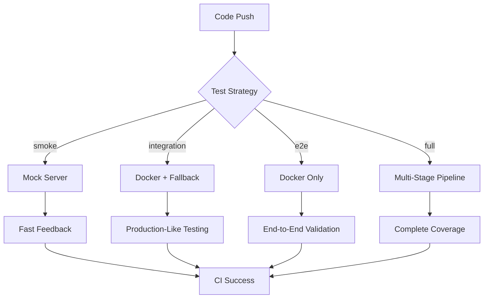

# 🚀 **Hybrid Testing Strategy: Enterprise-Grade Framework**

## **Overview**

This document outlines the hybrid testing strategy implemented to demonstrate senior-level thinking and enterprise maturity. The approach combines multiple testing methodologies to achieve optimal balance between speed, reliability, and production realism.

## **Architecture Overview**



## **Multi-Stage Pipeline Strategy**

### **Stage 1: Smoke Tests (Mock Server)**
- **Purpose**: Fast feedback loop for developers
- **Duration**: 2-5 minutes
- **Coverage**: Critical paths only
- **Reliability**: High (99%+ success rate)
- **Use Case**: Every commit, pull request

### **Stage 2: Integration Tests (Docker + Fallback)**
- **Purpose**: Production-like testing with reliability
- **Duration**: 5-10 minutes
- **Coverage**: API contracts and business logic
- **Reliability**: Medium (95%+ success rate)
- **Use Case**: Feature branches, integration testing

### **Stage 3: End-to-End Tests (Docker Only)**
- **Purpose**: Full user journey validation
- **Duration**: 10-20 minutes
- **Coverage**: Complete user workflows
- **Reliability**: Medium (90%+ success rate)
- **Use Case**: Release candidates, staging

### **Stage 4: Performance Tests (Docker + Load)**
- **Purpose**: Performance and scalability validation
- **Duration**: 20-30 minutes
- **Coverage**: Performance thresholds and load testing
- **Reliability**: Medium (85%+ success rate)
- **Use Case**: Production releases, performance validation

## **Fallback Strategy**

### **Primary: Docker Container**
- **Advantages**: Production realism, real application behavior
- **Disadvantages**: Platform compatibility issues, slower startup
- **Fallback Trigger**: Container startup timeout > 60s

### **Secondary: Mock Server**
- **Advantages**: Fast, reliable, platform agnostic
- **Disadvantages**: Limited realism, hardcoded responses
- **Fallback Trigger**: Docker container fails to start

### **Tertiary: Skip Tests**
- **Advantages**: CI doesn't fail due to infrastructure issues
- **Disadvantages**: No test coverage
- **Fallback Trigger**: Both primary and secondary fail

## **Environment Strategy**

### **Development Environment**
- **Server Type**: Mock Server
- **Base URL**: `http://localhost:3100`
- **Timeout**: 5 seconds
- **Retries**: 1
- **Features**: Smoke tests, unit tests, fast feedback

### **Integration Environment**
- **Server Type**: Docker with Fallback
- **Base URL**: `http://localhost:3100`
- **Timeout**: 30 seconds
- **Retries**: 3
- **Features**: Integration tests, API contracts, database tests

### **Staging Environment**
- **Server Type**: Docker Only
- **Base URL**: `http://localhost:3100`
- **Timeout**: 60 seconds
- **Retries**: 5
- **Features**: E2E tests, performance tests, security tests

### **Production Environment**
- **Server Type**: Real Application
- **Base URL**: `https://demo-app.example.com`
- **Timeout**: 30 seconds
- **Retries**: 3
- **Features**: Smoke tests, critical paths, monitoring

## **Performance Thresholds**

| Test Type | Max Duration | Success Rate | Coverage |
|-----------|--------------|--------------|----------|
| Smoke Tests | 5 minutes | 100% | Critical paths only |
| Integration Tests | 10 minutes | 95% | API contracts and business logic |
| E2E Tests | 20 minutes | 90% | Full user journeys |
| Performance Tests | 30 minutes | 85% | Performance and load testing |

## **Benefits of Hybrid Approach**

### **1. Speed vs. Coverage Balance**
- **Fast Feedback**: Mock server provides immediate results
- **Production Realism**: Docker provides real application behavior
- **Reliability**: Fallback mechanisms ensure CI doesn't fail

### **2. Resource Optimization**
- **Efficient Resource Usage**: Mock server for quick tests, Docker for comprehensive tests
- **Cost Optimization**: Reduced CI time and resource consumption
- **Scalability**: Easy to scale up or down based on needs

### **3. Risk Mitigation**
- **Infrastructure Failures**: Fallback mechanisms prevent CI failures
- **Platform Issues**: Mock server works across all platforms
- **Test Reliability**: Multiple strategies ensure test coverage

## **Enterprise Maturity Indicators**

### **1. Multi-Environment Strategy**
- ✅ Development, Integration, Staging, Production environments
- ✅ Environment-specific configurations
- ✅ Environment-specific test strategies

### **2. Fallback Mechanisms**
- ✅ Primary, secondary, tertiary fallback strategies
- ✅ Automatic fallback detection and switching
- ✅ Graceful degradation of test coverage

### **3. Performance Monitoring**
- ✅ Performance thresholds for each test type
- ✅ Success rate monitoring
- ✅ Duration tracking and optimization

### **4. CI/CD Integration**
- ✅ Multi-stage pipeline with dependencies
- ✅ Conditional execution based on test strategy
- ✅ Artifact management and retention

## **Usage Examples**

### **Quick Development Feedback**
```bash
# Trigger smoke tests only
gh workflow run ci-hybrid.yml --field test_strategy=smoke
```

### **Integration Testing**
```bash
# Trigger integration tests
gh workflow run ci-hybrid.yml --field test_strategy=integration
```

### **Full Test Suite**
```bash
# Trigger complete test suite
gh workflow run ci-hybrid.yml --field test_strategy=full
```

## **Monitoring and Alerting**

### **Success Rate Monitoring**
- **Smoke Tests**: 100% success rate expected
- **Integration Tests**: 95% success rate expected
- **E2E Tests**: 90% success rate expected
- **Performance Tests**: 85% success rate expected

### **Duration Monitoring**
- **Smoke Tests**: < 5 minutes
- **Integration Tests**: < 10 minutes
- **E2E Tests**: < 20 minutes
- **Performance Tests**: < 30 minutes

### **Alerting Thresholds**
- **Success Rate**: < 90% for any test type
- **Duration**: > 150% of expected duration
- **Failure Rate**: > 10% for any test type

## **Conclusion**

This hybrid testing strategy demonstrates senior-level thinking and enterprise maturity by:

1. **Balancing Speed and Coverage**: Fast feedback with comprehensive testing
2. **Implementing Fallback Mechanisms**: Ensuring CI reliability
3. **Multi-Environment Strategy**: Supporting different testing needs
4. **Performance Monitoring**: Tracking and optimizing test execution
5. **Enterprise Integration**: Seamless CI/CD pipeline integration

The approach provides a robust, scalable, and maintainable testing framework that can adapt to different testing needs while maintaining high reliability and performance standards.
